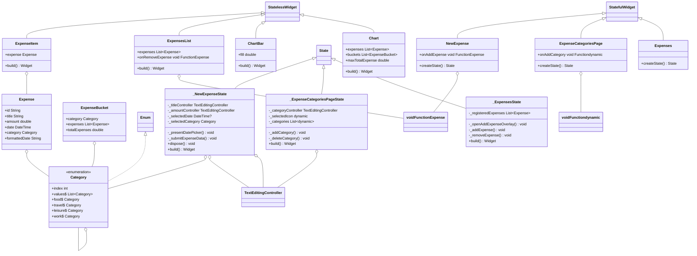

# Expense Tracker App Documentation

## App Architecture

The Expense Tracker app is designed using the Flutter framework, which follows a widget-based architecture. The key architectural components are as follows:

### 1. Widgets
- The app is built primarily using various widgets, which are the building blocks of the user interface.
- Widgets are organized into a hierarchical structure to create complex UIs.
- The main screen of the app is the `Expenses` widget, which serves as the entry point.

### 2. Data Models
- The app defines a data model called `Expense` to represent individual expenses.
- Expenses are categorized into predefined categories, and each expense has a unique identifier (`id`).
- Expenses are grouped into categories using the `Category` enumeration.

### 3. Business Logic
- Business logic for adding, removing, and managing expenses is implemented within the widgets.
- The `NewExpense` widget handles the addition of new expenses.
- The `ExpensesList` widget displays a list of expenses and allows users to remove them.
- The `Chart` widget displays a visual representation of expenses by category.

### 4. UI Components
- UI components such as `Card`, `ListView`, and various form input fields are used to build the user interface.
- Custom UI elements, like the `ChartBar`, are also implemented to visualize data.

## User Stories

The Expense Tracker app addresses the following user stories:

1. **Add Expense**
    - As a user, I want to add a new expense with a title, amount, date, and category.
    - I want to save the expense and have it displayed in the list of expenses.

2. **Remove Expense**
    - As a user, I want to remove an existing expense from the list.
    - I want to have the option to undo the removal in case of accidental deletion.

3. **View Expenses**
    - As a user, I want to view a list of all my expenses.
    - I want to see each expense's title, amount, category, and date.

4. **Visualize Expenses**
    - As a user, I want to see a visual representation (chart) of my expenses grouped by category.
    - I want to understand the distribution of expenses across different categories.

## Specifications

The Expense Tracker app has the following specifications:

- **Themes**: The app supports both light and dark themes, with color schemes tailored for each theme.
- **Date Formatting**: Dates are displayed in the "month/day/year" format.
- **Expense Categories**: Expenses can belong to one of four predefined categories: Food, Travel, Leisure, and Work.
- **Expense Chart**: The app provides a chart that visually represents expenses by category using colored bars.
- **Undo Feature**: When an expense is deleted, the app allows the user to undo the deletion within a certain time frame.
- **Validation**: Expense input is validated to ensure that titles, amounts, dates, and categories are provided correctly.

## File and Folder Structure

The app's code is organized into folders and files as follows:

- `lib/` (Root Directory)
    - `models/` (Folder for Data Models)
        - `expense.dart` (Definition of the `Expense` data model)
    - `widgets/` (Folder for Custom Widgets)
        - `chart/` (Subfolder for Chart-related Widgets)
            - `chart.dart` (Definition of the `Chart` widget)
            - `chart_bar.dart` (Definition of the `ChartBar` widget)
        - `expenses_list/` (Subfolder for Expenses List-related Widgets)
            - `expense_item.dart` (Definition of the `ExpenseItem` widget)
            - `expenses_list.dart` (Definition of the `ExpensesList` widget)
        - `expenses.dart` (Definition of the main `Expenses` widget)
        - `new_expense.dart` (Definition of the `NewExpense` widget)
    - `main.dart` (Entry point of the application)

The file and folder structure is designed to keep code organized, making it easier to maintain and extend the app's functionality.

## Class Diagram
